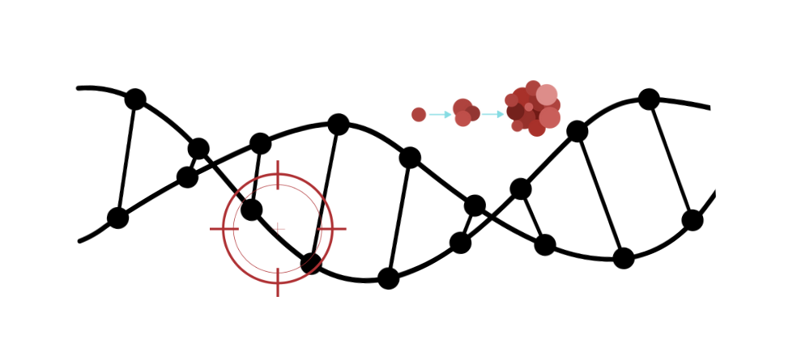

  

I’m currently a PhD student working in **functional genomics**, particularly in understanding **cancer biology** through **NGS data analysis**. My research focuses on **transcription factors, sequence-specific features, and regulatory mechanisms** in breast cancer.  

These are some of my interests that I have practical experience:  
- **ChIP-seq, ATAC-seq, RNA-seq, CRISPR screens**  
- **Data visualization & statistical analysis**  
- **Clinical-genomic data integration**  

---

### 📂 **Projects**  
🧬 [ChIP-seq Peak Analysis](https://github.com/yourusername/ChIPseq_Analysis) – A pipeline for TF binding site analysis in breast cancer.  
✂️ [CRISPR Screening Analysis](https://github.com/yourusername/CRISPR_Screening) – Investigating regulatory region perturbations.  

---
📨 [Email](mailto:fberber20@ku.edu.tr)  

---

